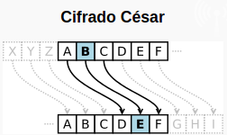

# Criptografía Cesar
Modifica el programa que se encuentra en la carpeta `src` que se llama `exercise.py` y que contiene el siguiente código:

```python
def main():
  #escribe tu código abajo de esta línea

if __name__ == '__main__':
    main()
```

La línea `#escribe tu código abajo de esta línea` es un comentario, el programa la va a ignorar al ejecutarse.

- En [criptografía](https://es.wikipedia.org/wiki/Criptografía), el cifrado **César**, es una de las técnicas de [cifrado](https://es.wikipedia.org/wiki/Cifrado_(criptografía)) más simples y más usadas. Es un tipo de [cifrado por sustitución](https://es.wikipedia.org/wiki/Cifrado_por_sustitución) en el que una letra en el texto original es reemplazada por otra letra que se encuentra un número fijo de posiciones más adelante en el [alfabeto](https://es.wikipedia.org/wiki/Alfabeto). 

- Con un desplazamiento de 3, la A sería sustituida por la D (situada 3 lugares a la derecha de la A), la B sería reemplazada por la E, etc.

- (Wikipedia https://es.wikipedia.org/wiki/Cifrado_César)



<!--EN ESTE EJERCICION NO HAY INTERACCION CON EL USUARIO-->

1. Escribe un método llamado **codificacion_cesar** , que <u>reciba</u> un *string* y un *número entero* que representa el desplazamiento que se usará al encriptar el mensaje y que <u>regrese</u> un *string* con el mensaje encriptado.
2. Escribe un método llamado **decodificacion_cesar** , que <u>reciba</u> un *string* y un *número entero* que representa el desplazamiento que se usará al desencriptar el mensaje y que <u>regrese</u> un *string* con el mensaje sin encriptamiento.

Si imprimieramos el resultado de la siguietne llamada

`codificacion_cesar("Hola Mundo", 3)`

Daría como resultado

`Krod#Pxqgr`

De igual forma

`cesar.decodificacion_cesar("Krod#Pxqgr", 3)`

Daría como resultado

`Hola Mundo`

Una vez que termines tu actividad y la hayas probado con `pytest`, súbela a tu repositorio en GitHub, con el proceso de commit + push.

**Nota:** No te preocupes por esta parte del código `if __name__ == '__main__':` por el momento. No la vamos a necesitar para este programa, pero es una buena práctica incluirla y quedará más claro para que sirve en los siguientes ejercicios.

[]: 