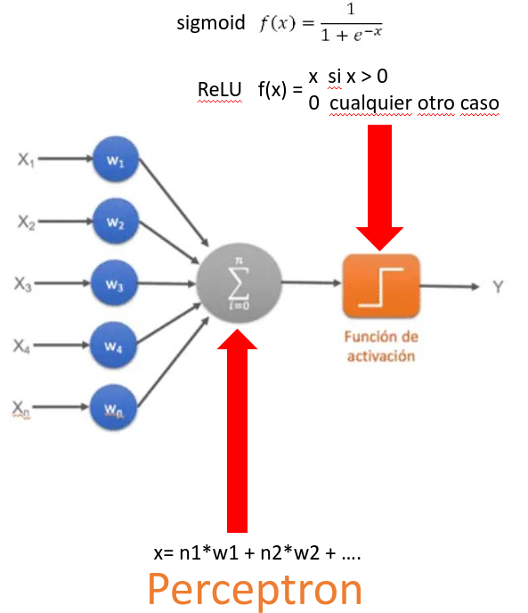

# Ejercicio Perceptrón

Escriba un programa llamado **perceptron.py**

Defina un método llamada **salida_neurona** que reciba dos vectores (listas)

- Vector **x** que representan las salidas de otras neuronas conectadas a ella.
- Vector **w** que representan los pesos entre las neuronas.

- Realize la sumatoria de la "multiplicación" de los dos vectores.
- A esta sumatoria aplique la función de activación sigmoid
- Regrese el valor de salida de la neurona

