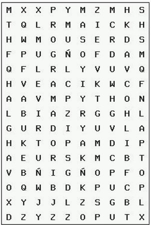

# Mock Exam

## Sopa de Letras

****

Teniendo el archivo llamado **sopa.txt** que representa la siguiente matriz de información

Escriba un programa llamado **sopa.py** que se encuentre en el folder *src* que contenga una función llamada **busca_palabras** que reciba *dos parámetros*:

1. Lista de strings (filas) del archivo sopa.txt  
2. String a buscar dentro de la lista

Y que regrese False o True si es que la encuentra o no.

------

Ya que  su función busca_palabras funcione correctamente

Dentro de la función  main abra el archivo **palabras.txt** y busuqe cada una de las palabras ahí indicadas

