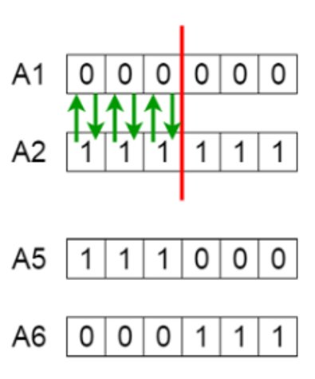

# Ejercicio Algoritmo Genético

Escriba un programa llamado **genetico.py** en el folder src

------

Defina un método llamada **cruzamiento** que reciba *dos* elementos  (*listas*) y el punto de cruzamiento. Regresará una lista con las dos nuevas listas (los elementos generados después del proceso de cruzamiento).

Por ejemplo :

`cruzamiento([0,0,0,0,0,0],[1,1,1,1,1,1], 2)`

dará como resultado

`[[1,1,1,0,0,0] , [0,0,0,1,1,1]]`

