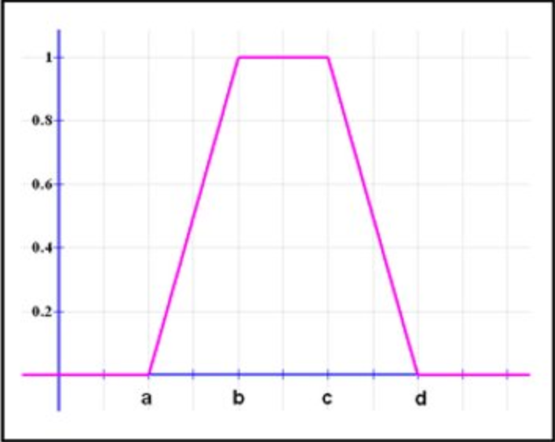
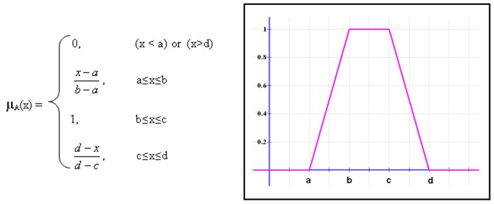

# Examen Práctico Integrador TC1028 Agosto-Diciembre 2021

### <u>**Por favor lee detenidamente las instrucciones del examen práctico.**</u>

Este examen debe ser entregado de la siguiente forma:

- En eLumen (Canvas) en un archivo *comprimido (zip)*
- En *GitHub Classroom*

## El tiempo de examen es de 2 horas , tanto Canvas como GitHub tiene como límite el final de la clase.

1. Diagrama de flujo del algoritmo de solución (code2flow) en JPG o PNG que contará ***10 puntos,*** si el diagrama es diferente a lo que se encuentra en el código, no será tomado en cuenta.
2. Docstring completo y que tu código se ajuste a las convenciones de estilo del lenguaje Python ***(10 puntos)***
3. Los puntos restantes serán otorgados en la correcta implementación de lo solicitado (ejercicio).

## Ejercicio Parte 1: (60 puntos)

Teniendo una función representada por 4 valores :  ***a , b , c , d*** 

El cálculo de la membresía (**valor en el eje y**) se realiza de la siguiente forma.

Teniendo un **valor x** que representa un punto en el **eje x**

Genere un archivo llamado **difuso.py**  y escriba una función llamada **calculo_membresia** que reciba una **lista** con los 4  valores que representan la función y un **valor x** que representa el valor en el **eje x** sobre el cual queremos obtener  su valor correpsondiente en el **eje y**.

La función debe de *regresar* el **valor (flotante)** que represente el  valor entre 0 y 1 de la intesección en el **eje y** del valor dado.

Los puntos a implementar son:

- Uso de decisiones.
- Creación de funciones.
- Uso de listas.
- Operaciones matemáticas.

------

Ejemplos de como usar la función

`calculo_membresia([10,20,30,40] , 25)  regresará 1.0`

`calculo_membresia([10,20,30,40] , 5)  regresará 0.0`

`calculo_membresia([10,20,30,40] , 15)  regresará 0.5`

# Ejercicio Parte 2: (20 puntos)

En la función main :

Lea del archivo **funciones.txt** , cada fila representa los valores **a, b , c , d** de una función y el **valor x** con el cual se va a evaluar la función.

Mande llamar la función **calculo_membresía** para cada fila del archivo e imprima a pantalla el resultado de la función **cálculo_membresía**. 

Los puntos a implementar son:

- Uso de String.
- Lectura de archivo.
- Uso de listas.
- Uso de ciclos.

